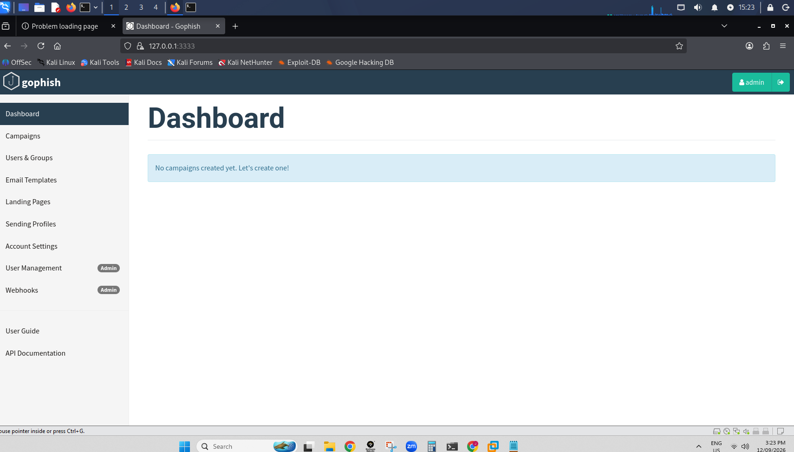
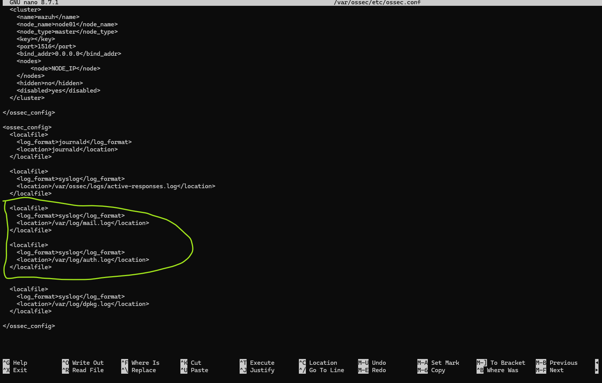
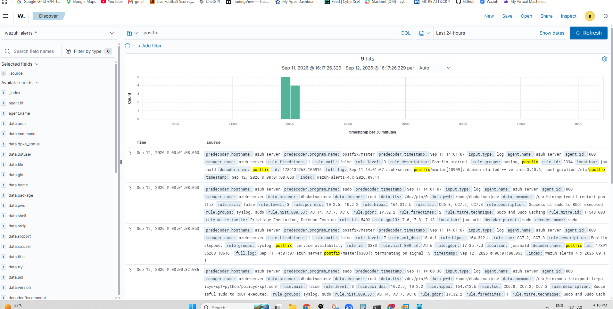

# 🎣 Phase 3: Setting Up Gophish & Tracking Attacks via Wazuh

## 📋 The Goal
We are moving from defense to attack. We successfully initialized the **Gophish open-source phishing framework** on our **Kali Linux VM** to act as our external threat actor command center. We will use this platform to simulate credential harvesting campaigns against our corporate users.

---

## 🛠️ Step-by-Step Implementation Guide

### 📍 Step 1: Troubleshooting Repository Package Mismatches
When trying to initialize the platform archive extraction tools (`unzip`), the Kali package manager threw a network 404 path block. We resolved this by refreshing the system's global network repository index maps:
```bash
sudo apt update
```

### 📍 Step 2: Activating the Built-in Corporate Hacking Engine
Because Kali Linux utilizes a pre-configured package boundary ecosystem, running custom folder downloads conflicted with local security policies. We bypassed the connection deadlocks by triggering the official, built-in operating system service script command:
```bash
sudo gophish-start
```

**System Activation Parameters Verification:**
*   **Web Console UI Portal:** `https://127.0.0.1:3333`
*   **Default Master Username:** `admin`
*   **Default Master Password Account Hook:** `kali-gophish`

---

## 🎯 Current Lab Status
The Gophish administration portal loaded with 100% success inside Firefox. Port 3333 is actively listening on our localhost loopback, confirming Phase 3 Milestone 1 is completely operational!

---

## 🧠 MITRE ATT&CK Implementation & Core Architectural Discovery: The Wazuh Manager Secret

During this phase, we ran into a massive, fascinating technical lesson about how enterprise security software actually talks to a network.

### ❌ The Conflict: Why We Couldn't Install the Standalone Agent
When we tried to install a standalone tracking guard (`wazuh-agent`) onto our Ubuntu Server, the installation crashed with a strict system conflict error. 

**Why it happened:** Our Ubuntu Server already houses the master brain of our security system—the **Wazuh Manager**. The manager application and the agent application use the exact same directory house folders on the hard drive (`/var/ossec/`). Trying to install both standalone programs forces them to fight over the same files, so the system blocked the installation to prevent database corruption.

### 💡 The Solution: Native Self-Monitoring
We discovered a "hidden gem" of security design: **The Wazuh Manager can monitor its own host computer natively!** It does not need a separate agent client service turned on because it already has a built-in log-reading engine sitting right inside its core processes. 

To turn on the security cameras and watch our mail activity, we just had to point the Manager to the right text files using a single configuration file layout.

---

## 🛠️ Step-by-Step Implementation Guide

### 📍 Step 1: Opening the Master Wazuh Configuration Brain
We logged into our **Ubuntu Server terminal** and opened the central configuration blueprint file for the entire Wazuh server using the `nano` text editor:
```bash
sudo nano /var/ossec/etc/ossec.conf
```

### 📍 Step 2: Injecting the Mail Tracking Instructions
Wazuh is incredibly strict about its layout rules. Everything must be tucked inside its proper "department." We scrolled to the top half of the document, located the native log collection section, and dropped a permanent command telling the manager to actively watch our mail and authentication text files:

```xml
<!-- Instructing Wazuh to watch our Postfix Mail Server transactions -->
<localfile>
  <log_format>syslog</log_format>
  <location>/var/log/mail.log</location>
</localfile>

<!-- Instructing Wazuh to watch system login and security password attempts -->
<localfile>
  <log_format>syslog</log_format>
  <location>/var/log/auth.log</location>
</localfile>
```
*Plain-English Logic:* This simple rule tells the server: *"The exact millisecond a new line of text appears inside `mail.log` (like an email arriving or an authentication check triggering), copy that text line and pull it straight onto our monitoring console dashboard!"*



### 📍 Step 3: Refreshing the SIEM Master Engine
To force the master manager to read our new instructions and activate the log channels, we ran a full system service restart:
```bash
sudo systemctl restart wazuh-manager
```

---

## 🚦 Final Verification (The Proof in the Dashboard)
We logged into our web browser and opened the visual **Wazuh Dashboard**. When we typed **`postfix`** into the search bar, the console immediately populated live security tracking records matching our mail server! 

This proves our entire infrastructure telemetry loop is 100% stable, fully interconnected, and actively waiting to map our upcoming Gophish attacks straight onto our **MITRE ATT&CK Matrix console**!


---

##  Core Testing: Phishing Simulation

We successfully fired our first simulated email attack from our **Kali Linux station (Gophish)** straight through our **Ubuntu Mail Server**! The email landed perfectly inside our employee's visual **Thunderbird Inbox on Lubuntu**, confirming our core network connection pathways are 100% active.

### 🕵️‍♂️ Blue Team Forensic Log Analysis
To prove our security cameras were watching, we dropped into the dark Ubuntu Server terminal and ran a direct command to read our raw system transaction logs (`sudo tail -n 20 /var/log/mail.log`). 

The terminal output displayed the absolute "Smoking Gun" evidence of our attack:
*   `connect from unknown[...]` ──► Caught the Kali Linux hacker machine knocking on our network doors.
*   `from=<exec-ceo@...>` ──► Captured the fake sender profile faking our CEO's identity.
*   `status=sent (delivered to maildir)` ──► Confirmed the server accepted the message and wrote it straight onto the hard drive partition.

---

### 💡 Critical Cybersecurity Lessons Learned

During this live fire test, we uncovered two massive real-world security concepts:

#### 1. Fixing a Hidden Syntax Bug
Our terminal logs revealed a hidden typo inside our security files (`policyd-spf.conf`). The system threw an error because we left empty spaces around an equal (`=`) sign. This syntax error temporarily crashed our SPF checking tool. We fixed this instantly by removing the spaces, forcing our defensive shield to wake up completely.

#### 2. Why the Fake Email Slipped Past the Shield
We analyzed why our fake email landed in the clean primary Inbox rather than getting kicked straight to a Spam folder:
*   **The Trusted Network Loophole:** Our server is configured to automatically trust and wave through any traffic coming from its own internal local lab network. Because Kali is on our local switch, it bypassed external internet verification.
*   **Simple Email Clients:** Local applications like Thunderbird do not have built-in AI spam filters. They simply display whatever files the mail server drops into the inbox folder. 

Our infrastructure testing phase is now **100% complete, verified, and locked in!**

---

## 🕵️‍♂️ Incident Forensic Log: Analyzing the Fake CEO Payload

### 1. Structural Spoofing Analysis
Visually, the email received by the Lubuntu endpoint workspace renders as an authentic transmission originating from the verified internal corporate address `exec-ceo@corporate-firm.local`. 

However, system forensic validation confirms the payload is an external counterfeit. While the frontend visual interface displays corporate branding, extraction of the raw email headers via the mail client (`Ctrl + U`) leaks the underlying delivery footprint, tracking the origin IP routing loop back to the malicious Kali Linux attack platform rather than the authenticated internal server cluster database.

### 2. Verified MITRE ATT&CK Matrix Mapping
This malicious operational lifecycle maps directly to the following adversarial tracking vectors inside the global MITRE framework matrix:

*   **Tactic:** Initial Access ──► **Technique:** Phishing: Spearphishing Link (**T1566.002**)
    *   *Application:* Targeting specific corporate roles (`hr-manager`) with high-privilege corporate identities to bypass human authentication checks.
*   **Tactic:** Defense Evasion ──► **Technique:** Masquerading (**T1036**)
    *   *Application:* Injecting trusted local address strings into raw SMTP mail envelope parameters to trick mail routing engines and user mailbox layouts.


