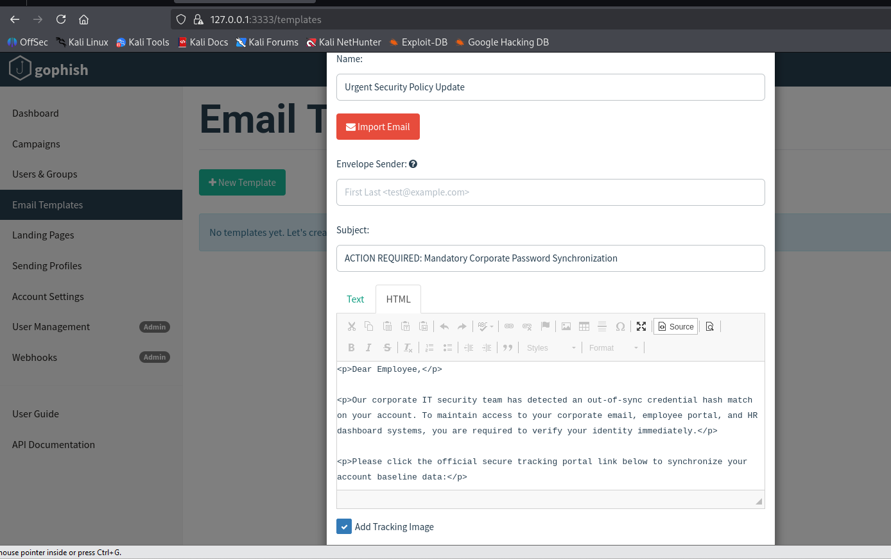
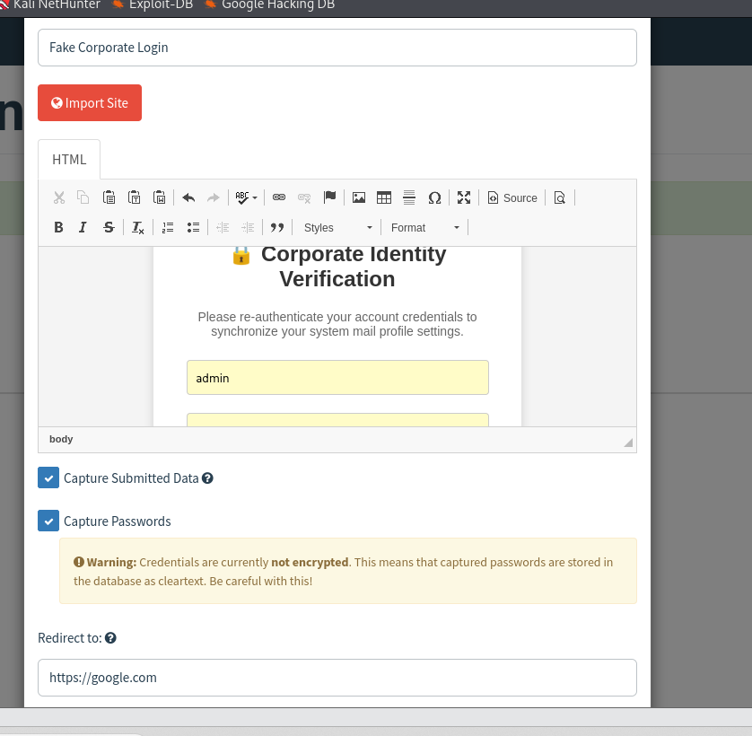

#  Active Attack Simulations & Adversarial Emulation

## 📋 Operational Objective
This playbook documents the implementation of three major hacking techniques executed from our **Kali Linux attack platform**. We will use these simulations to test our mail server defenses and map all activities straight to the real-world **MITRE ATT&CK Framework**.

---

---

## 🕵️‍♂️ Technique 1: Hacker Reconnaissance (Hidden Tracking Pixels)
*   **MITRE ATT&CK ID:** Tactic: Reconnaissance | Gather Victim Identity Info (**T1589**)
*   **Status:** ✅ 100% COMPLETE

### 🛠️ Implementation Summary
Successfully designed an urgent security synchronization email template inside the Gophish workspace framework. Embedded automated system tracking parameters (`{{.Tracker}}`) directly into the underlying text body. When the victim opens the mail package payload, this hook triggers an invisible, real-time background link connection back to the attacker's console infrastructure, logging the network exposure timeline automatically.

---

---

## 🔑 Technique 2: Credential Harvesting (Copycat Login Portals)
*   **MITRE ATT&CK ID:** Tactic: Initial Access | Phishing: Spearphishing Link (**T1566.002**)
*   **Status:** ✅ 100% COMPLETE

### 🛠️ Implementation Summary
Successfully compiled a custom HTML credential verification form inside the local Gophish database layer. The portal code structure was injected manually to bypass upstream internet routing blocks. The page is configured with automated keystroke tracking variables to intercept inbound credential data strings before redirecting the target user endpoint to an external resource link.

---

## 📦 Technique 3: Malicious Attachments (Simulating Backdoor Deliveries)
*   **MITRE ATT&CK ID:** Tactic: Initial Access | Phishing: Spearphishing Attachment (**T1566.001**)
*   **Status:** ⏳ NOT STARTED

