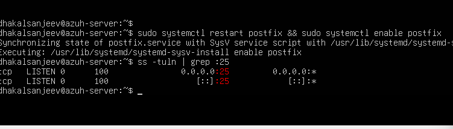

# Technical Walkthrough: Building the Corporate Mail Server

This document explains the step-by-step process of installing and configuring our private mail infrastructure on the Ubuntu Server. 

---

## 🛠️ Step 1: Updating the Server and Installing Postfix

Before installing new software, we must tell the Ubuntu operating system to refresh its list of available packages. Then, we download the core mail delivery program (**Postfix**) and a tool helper package (**mailutils**).

command in  Ubuntu Server terminal:
```bash
sudo apt update && sudo apt install -y postfix mailutils
```

---

## ⚙️ Step 2: Navigating the Configuration Screen

During the installation, a blue-and-pink interactive setup wizard will appear inside your terminal screen. 

1. **First Screen (General Type):** Use your arrow keys to highlight **`Internet Site`** and press **Enter**. This tells the server to use standard web communication rules to route emails.
2. **Second Screen (System Mail Name):** Type our custom corporate domain name exactly: **`corporate-firm.local`** and press **Enter**. This ensures any internal users we create later will have email addresses ending in `@corporate-firm.local`.

---

## 📂 Step 3: Configuring Mail Storage Rules

By default, Linux saves emails in an old, cluttered format. We need to edit the Postfix configuration file to force the server to save every email as a neat, separate file inside a folder called `Maildir`. This makes it much easier for our Wazuh security agent to read and monitor the logs later.

1. Open the main configuration file using the Nano text editor:
   ```bash
   sudo nano /etc/postfix/main.cf
   ```
2. Use  arrow keys to scroll all the way down to the very bottom of the file.
3. Type out these three lines exactly as shown (use the spacebar for spacing, do not press Tab):
   ```text
   home_mailbox = Maildir/
   mailbox_command = 
   inet_interfaces = all
   ```
   * *`inet_interfaces = all`* opens the server doors so it can receive emails sent from our Kali Linux attacker machine or Lubuntu client.
4. Press **`Ctrl + O`** and then hit **`Enter`** to save  file modifications.
5. Press **`Ctrl + X`** to exit the text editor and return to the main command prompt.

---

## 🚀 Step 4: Starting and Testing the Mail Service

Now that our configuration files are updated, we need to restart the background mail engine so it can read our changes and turn itself on automatically every time the server boots up.

Run this command:
```bash
sudo systemctl restart postfix && sudo systemctl enable postfix
```

Finally, we run a network check command to verify that our mail server is actively awake and listening for traffic on standard SMTP **Port 25**:
```bash
ss -tuln | grep :25
```


  

### Expected Output:
If the setup is working correctly, we will see a text line on your screen containing the word **`LISTEN`** right next to **`*:25`**. This means our private network post office is officially live and waiting to process messages!

