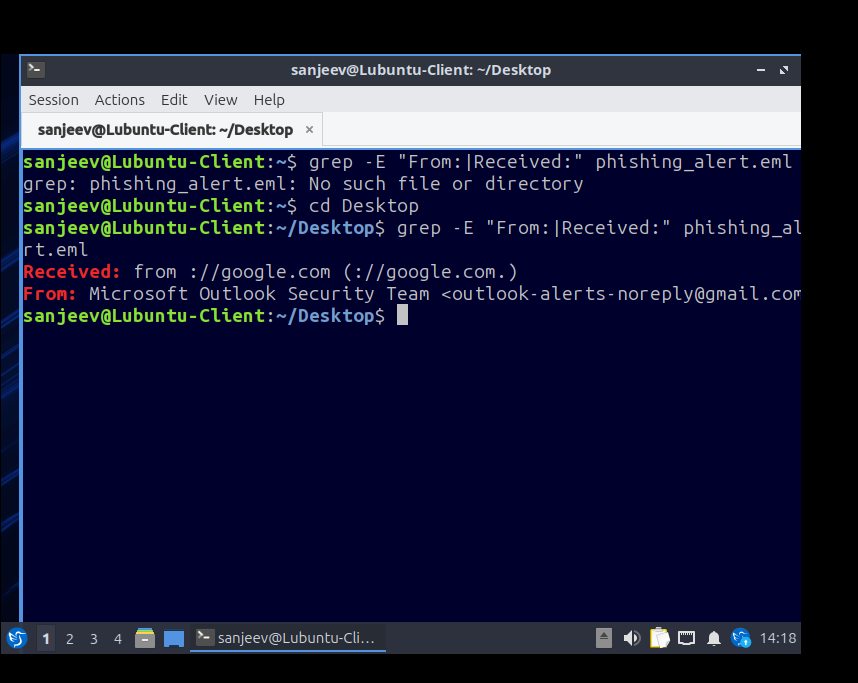
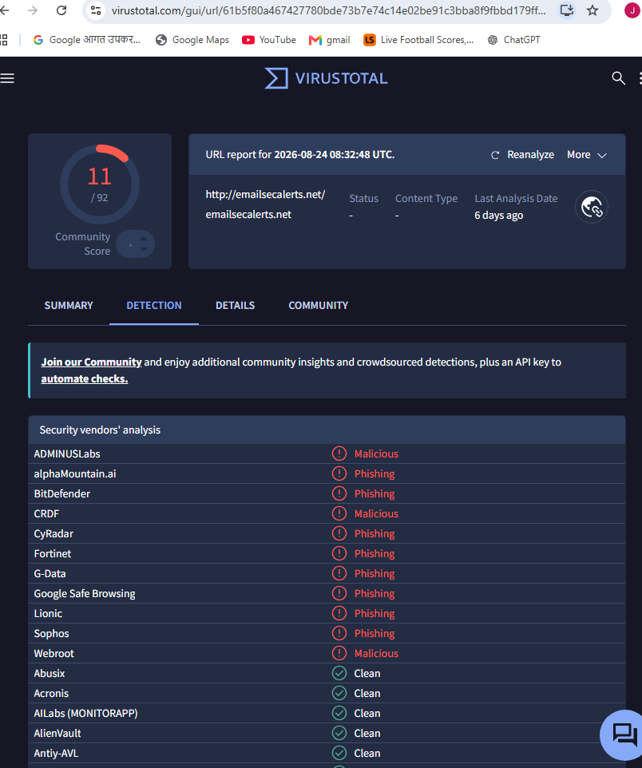
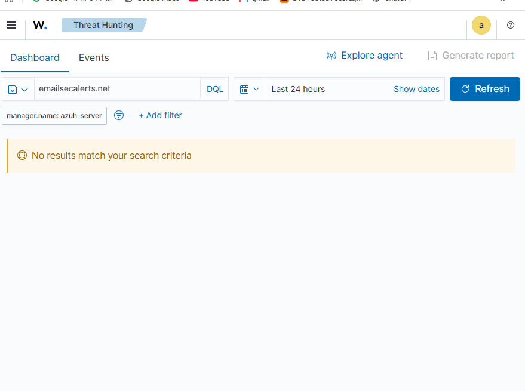

# Phishing Triage Case Study: Fake Outlook Security Alert

## 📋 Incident Summary
An employee reported receiving a suspicious email themed to look like a critical "Outlook Web Access" security warning. The email stated the user's mailbox would be closed unless they verified their identity via an embedded link button. 

I performed a full security investigation using text forensics, threat intelligence tools, and centralized SIEM analytics to find out if the company was compromised.

RAW EMAIL HEADER
-----------------

Delivered-To: victim-employee@company.com
Received: from ://google.com (://google.com.)
        by ://google.com with SMTPS id x11sor4321949vka.3.2026.08.20.10.30.00
        For <victim-employee@company.com>;
        Thu, 20 Aug 2026 10:30:00 -0700 (PDT)
From: Microsoft Outlook Security Team <outlook-alerts-noreply@gmail.com>
To: victim-employee@company.com
Subject: CRITICAL: Your Mailbox Will Be Closed - Verify Identity Now
Date: Thu, 20 Aug 2026 17:30:00 +0000


---

## 🔍 Investigation Steps & Findings

### 1. Email Header Check (Text Forensics)
I opened the raw email code (`.eml` file) inside my **Lubuntu client** terminal and ran a filtering command to isolate who sent it:
```bash
grep -E "From:|Received:" phishing_alert.eml
```
*   **The Lie:** The display name stated it was from the "Microsoft Outlook Security Team."
*   **The Truth:** The real underlying email address inside the mail headers was a consumer account ending in **`@gmail.com`**. Microsoft would never send an infrastructure warning from a consumer Google account.

  

### 2. Threat Intelligence Verification (OSINT)
I extracted the malicious website domain button link from the message: `emailsecalerts.net`. I searched this domain on **VirusTotal** to check its reputation.
*   **The Result:** **11 out of 92 security vendors** flagged the domain as highly dangerous, confirming it is an active **Phishing / Credential Harvester** setup designed to steal company employee passwords.

  

### 3. Impact Analysis via SIEM (Threat Hunting)
The most critical phase of the investigation was checking if any employee fell for the trick and clicked the button link. 

I logged into my **Wazuh SIEM Dashboard** and searched across the entire company network database for any logs matching: **`emailsecalerts.net`**.
*   **The Result:** **0 Results Found.**

  

---

## 🛡️ Final Triage Verdict & Action Taken
*   **Verdict:** **Malicious Intent (Credential Harvester) - Contained.**
*   **Analysis:** The email is verified as an active phishing threat, but the risk to our infrastructure is zero. Thanks to the endpoint monitoring agent data, I verified that no network traffic ever attempted to visit the malicious domain. 
*   **Action Items for the Company:** 
    1. Purge the phishing email from all other employee mailboxes using the email gateway control tools.
    2. Add `emailsecalerts.net` to the corporate firewall blacklist so it is physically blocked if anyone tries to click it in the future.
